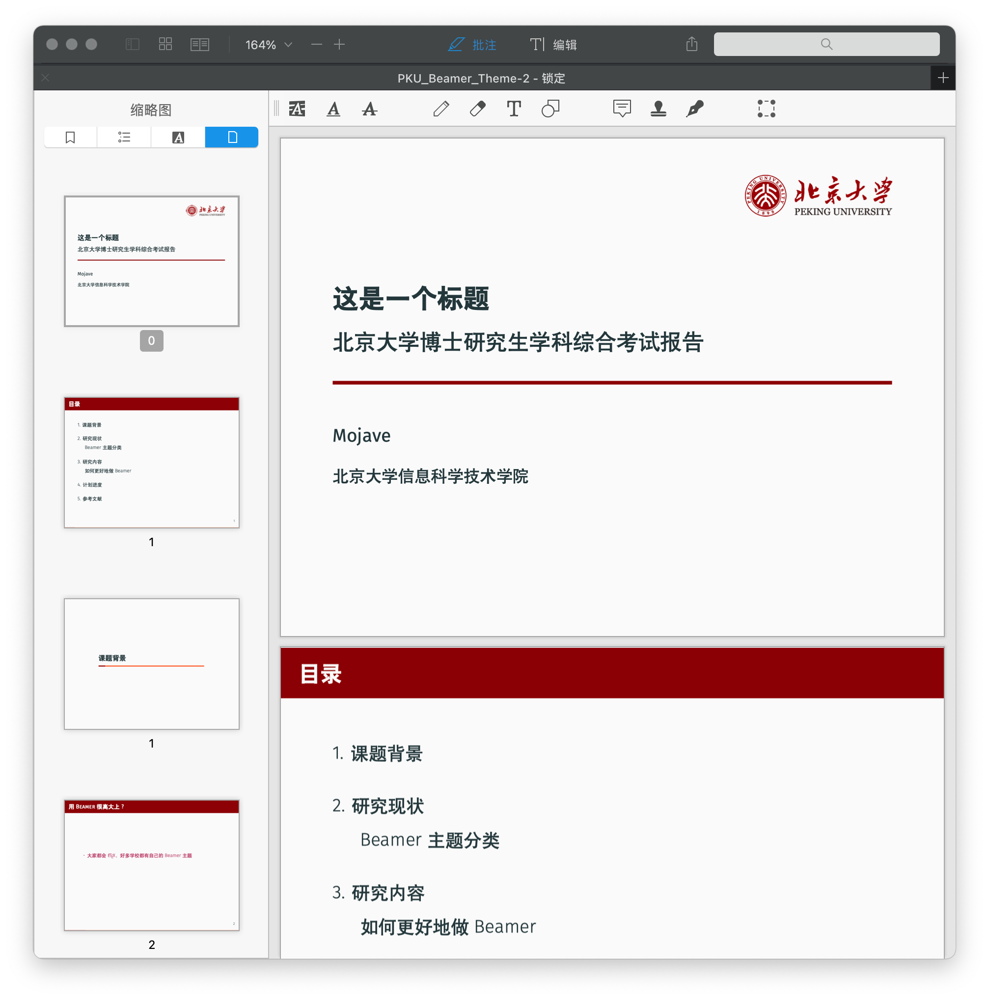
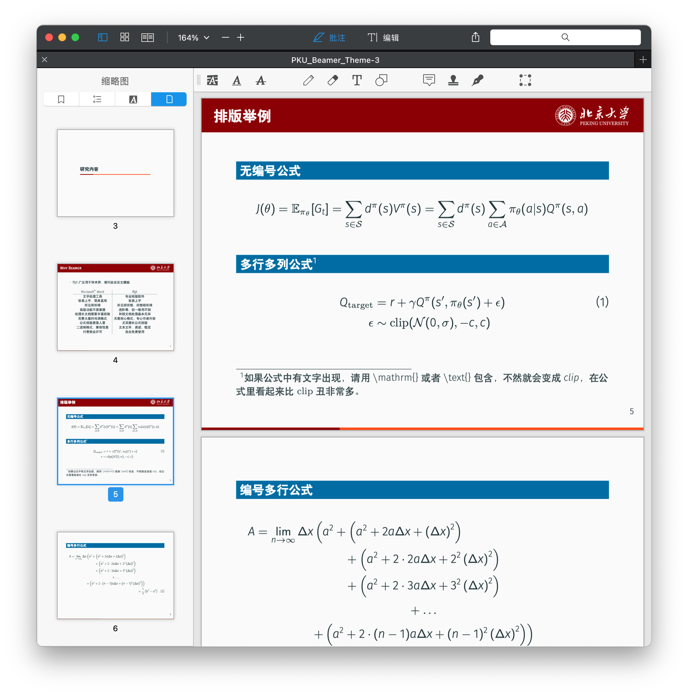

# PKU_Beamer

模版基于[UNC-charlotte-beamer](https://www.overleaf.com/latex/templates/unc-charlotte-beamer-theme/rnwqwjmrnmsk)进行修改：

- 根据[北大标识管理办公室的配色指引](https://vim.pku.edu.cn/docs/20171026163443134569.pdf)进行配色
- 在首页加入了北京大学Logo

模板的中文填充部分来源于[PKU-Beamer-Theme](https://github.com/inFaaa/PKU-Beamer-Theme)和 [THU-Beamer-Theme](https://github.com/Trinkle23897/THU-Beamer-Theme)。

## 样式展示

